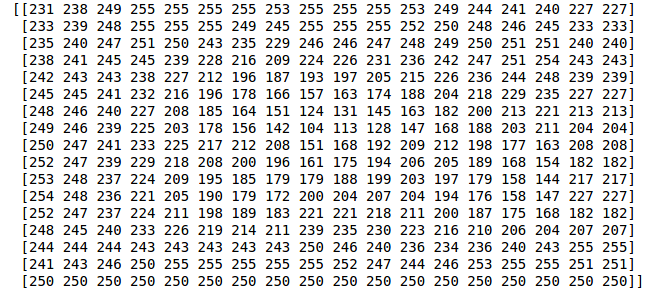
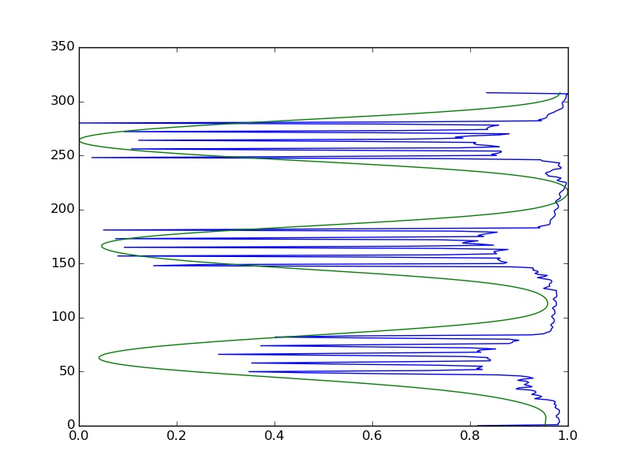
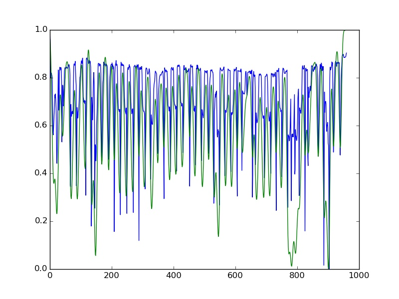

# How does ReadNotes work

## Structure of the project

All python scripts are saved in the folder SCRIPTS. The original note files are in the folder ORIGINALS and 
should never be changed. The preprocessed files are saved in the folder PREPROCESSED. In PREPROCESSED
there are four different folders for the different steps of the preprocess.

## Preprocess: From scanned notes to single note files

### Rotate image
The first step of the preprocess is handled by the python file auto_rotate_scanned_notes.py
This takes the note files from ORIGINALS and rotates the whole file such that the staves are horizontal.
The rotated files are saved in PREPROCESSED/STRAIGHT. 

Original image

Straight image

### Shrink image size
Mostly the size of a scanned image is large. This would make the process and calculation very longly.
It is sufficient precise, if we shrink the images to a smaller size.
We simply use the programm 'convert' to shrink the image size to 1000 pixel horizontally - of course the number of pixel on the vertical axis depends because 'convert' keeps the ratio. The shrinked images are saved in the folder PREPROCESS/SHRINKED

### Find staves
Next we want to separate the single staves from each other. With python we open the note file and convert the input to only black-white. Usually colors don't carry information regarding notes. We read the jpge input as array and obtain a matrix with numbers between 0 (black) and 255 (white).

We exploit the fact that staves basically are composed of five black lines, which cross the whole horizontal. The darker the color, the smaller the numbers of the matrix. 
This means, by adding up the columns of the matrix, we obtain a vector that has five minima per stave; one for each line of the stave.
In the following figure we see the normalized vector in blue and see for each of the three stave the five lines.

We smooth the blue curve using Laplacian smoothing and obtain the green line.
This is done such that we mathematically 'summarize' the five black lines to one whole. This green line has three maxima and we cut the line exactly at the maxima. 
The indices of the cuts are also used to cut the jpeg matrix.
Additionally, the separate matrices are verified to be staves and not the song header, text or anything else. Redundant white space from left, right, top and bottom is removed and finally we save the separated matrix pieces as jpg and obtain the single staves in the folder PREPROCESS/STAVES.

Here as an example the first stave:

### Find notes
The last step in the preprocess is to separate the single objects appearing in a stave from each other and save the object in single jpg files. This can be notes, clefs, rests, bars and so on. 
We open the jpg-file with the staves as matrix and again exploit the fact that the objects in the lines are black and hence are presented by smaller numbers in the matrix. This time we sum up the rows of the matrix and obtain a horizontal vector. After normalizing the vector, the five black lines of the staves do not impair the recognition of the objects because the lines go constantly through the whole image and cancel out. 
We regard the vector as a function and smooth it using Laplacian smoothing. This is done to avoid little deflections affecting the process. Now we search for maxima. In the following figure, the blue curve is the rows summed up and the green curve is the smoothed vector.

Cutting the matrix at the maxima found using the green line, we obtain the objects appearing in the stave. 
We want that all jpg file containing the objects have the same size and add or remove therefore some white space.
Finally the objects are saved as jpg files in PREPROCESS/NOTES. Some samples are plotted below.

  |  |  |  | 
:-------------:|:--------------:|:--------------:|:--------------:|:--------------:
 |  |  |  | 

    
## Classify: From single note files to note-or-not-note recognition

### Make training set
The aim of the following steps is to build a classifier using Google's library Tensorflow which regonizes if a note file contains a note or a not-note. The not-note could be a clef, rest, bar,..
Therefore we first need a large enough training set. The note file, we just created, must be split into notes and not-notes. We need to do this by hand because the computer cannot do this yet (That's just the point) and make a folder YES with all the notes and a folder NO with all the not-notes.

To multiply the number of training examples the python function create_variants creates for each file several other files with slightly changes content. The slight changes are shifting the image a few pixels up, down, left or right, bluring and clearing the image. 
Now we have a training set of over 150.000 samples.

### From jpg files to mathematical representation
To represent the jpg files in a mathematical way, the python function notes_to_csv.py writes a csv file X_notes.csv and inserts for each note file a row.
The row contains the jpg as matrix of size 32 x 80 reshaped to a vector of size 32\*80. The vector is normalized and only contains numbers between 0 and 1.
In another csv file Y_notes.csv the row entry is simply 1 or 0 depending if the note file contains a note or a not-note.

### Building the classifier

#### Logistic regression
First we try a simple neuronal network with just two layers: input and output layer. The size of the input layer is 2560, which is the amount of pixel per note file. The size of the output layer is 2, which stands for note and not-note. That means, we have only one weight matrix W of the size 2x2560 and a bias vector b of size 2. 
This procedure is equivalent to logistic regression.

To use Tensorflow, the training samples must be vectors with entries between 0 and 1, the training labels also must be vectors with one 1 and else 0 emphasizing the i-th entry. 

We define placeholders x and y_ for the training samples and the training labels, the variables W (weight matrix) and b (bias vector), the cost function using logistic regression and the optimization-algorithm and -accuracy.

In Tensorflow, the training steps obtain the training samples in separated batches to not overuse the capacity of the computer. 

After the classifier is build, we check its quality with the test set and see that we obtain an accuracy of 0.75

#### Multilayer neural network
The accuracy of the logistic regression is not very good. Without hidden layers the network is not able to recognize shapes or neglect the size of the note. Therefore we build another neural network with several layers and weight matrices.

We exploit the 2D shape of the note file and reshape the input layer to a matrix of size 80x32. After the first convolution which transforms the input layer to a 32x80x32 matrix as second layer, ReLu *f(x) = max(0,x)* is used for rectification and max_pool_2x2 is used to shrink the size of the second layer to  40x16x32. 

The second convolution transforms the second layer to a 64x40x16 matrix as third layer. Again ReLu is used for rectification and max_pool_2x2 shrinks the third layer to size 20x8x64.

We continue by reshaping the third layer back to a vector of size 20\*8\*64 and use a simple weight matrix of size 1024x20\*8\*64 and a bias vector of size 1024 to obtain the forth layer of size 1024 by matrix multiplication. Again we use ReLu.
In this layer we also use a dropout to randomly cancel out features to avoid overfitting.

Finally, we obtain the output layer by matrix multiplication with a weight matrix of size 2x1024 and bias vector of size 2. This time we use the sigmoid function softmax instead of ReLu as the last step.

As costfunction we take logistic regression and as optimization accuracy 1e-4.

After the classifier is build, we check its quality with the test set and see that the accuracy improved to 0.80
